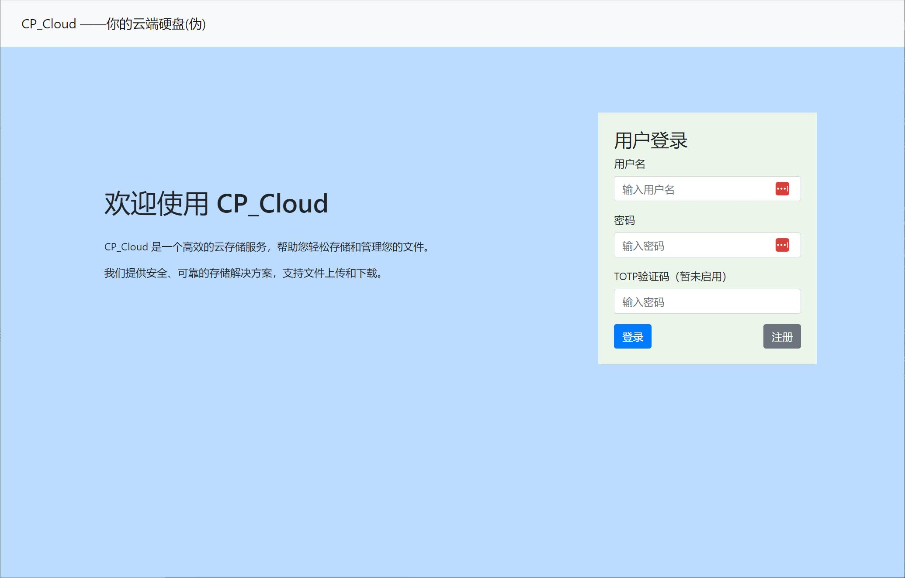
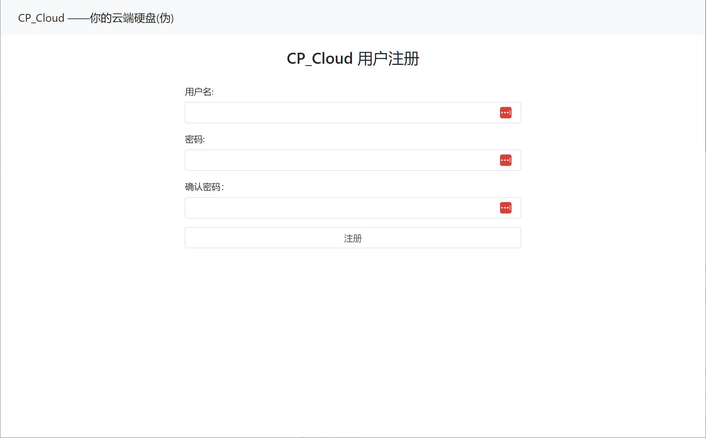
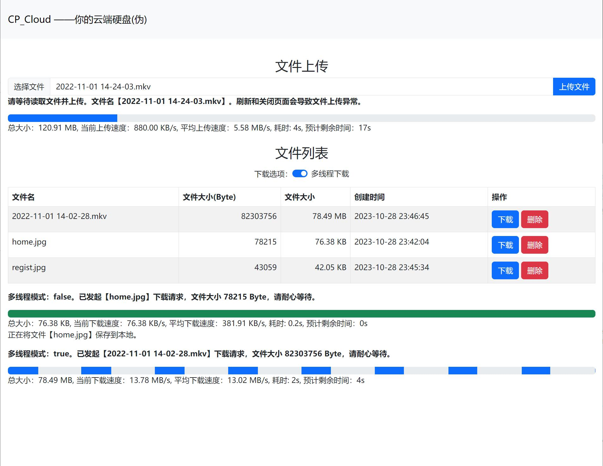
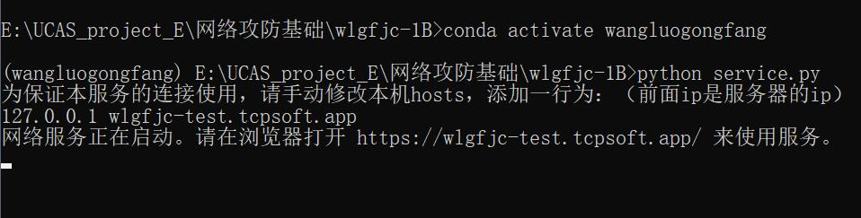

# wlgfjc-1B

UCAS-23秋网络攻防基础-作业1B-项目成果

## CP_Cloud ——你的云端硬盘(伪)

CP_Cloud 是一个~~高效~~的云存储服务，帮助您轻松存储和管理您的文件。

我们提供安全、~~可靠~~的存储解决方案，支持文件上传和下载。

&nbsp;

**关于项目的更多细节参考** [The Project Document.md](./The Project Document.md)

**关于项目的更多细节参考** [The Project Document.md](./The Project Document.md)

**关于项目的更多细节参考** [The Project Document.md](./The Project Document.md)

## 界面展示

首页，可以登录、注册



注册页，可以注册（和返回首页）



文件页，可以上传、单线程下载、多线程下载（和返回首页）



## 部署方式

步骤：

0. 安装conda（此处省略）、浏览器，连接至互联网。
1. conda 导入和创建环境，我这里这个环境名字叫 wangluogongfang  
   导入后应该就会自动安装conda管理的包  
   ```conda env create -f py36.yaml```
2. pip 安装剩余包。如果conda自动安装还有遗漏的，或者说后续第 4 步运行提示缺少包的，在此处pip安装  
   `pip install -r 27.txt`
3. 启用环境  
   `conda activate wangluogongfang`
4. 项目，启动！  
   `python service.py`
5. 按照命令行提示，向本机hosts文件（C:\Windows\System32\drivers\etc\hosts）中添加  
   `127.0.0.1 wlgfjc-test.tcpsoft.app`  
   这一行，然后就可以通过浏览器打开链接访问了  
   `https://wlgfjc-test.tcpsoft.app/`  
   【请注意】：该项目中包含的证书文件于【2024年1月15日 18:04:52】过期，届时浏览器中HTTPS证书将不受信任

命令行运行如图所示：



## 已完成功能（大概）

- 用户注册和跳转（post）
- 用户登录和跳转（post）
- 服务器端文件存储（文件系统）
- 列出用户文件夹文件（post）
- 删除用户指定文件（post）
- socket状态管理
- 文件下载状态管理
- 文件上传管理
- 文件上传
- 文件下载
- 多线程下载

## 规划功能（咕咕咕）

- 基于totp的2FA验证
- 多线程上传
- 网盘资源去重化和统一存储

## “友商竞品”

咱们这个项目也就图一乐，真要上手用还是看友商。

这里我列举一个 nextCloud，稍微听说过一点

[https://github.com/nextcloud/](https://github.com/nextcloud/)

nextCloud这个应该是可以本地部署的，功能也比较齐全，想部署私有云存储或者想学习的可以参考一下这个项目。
