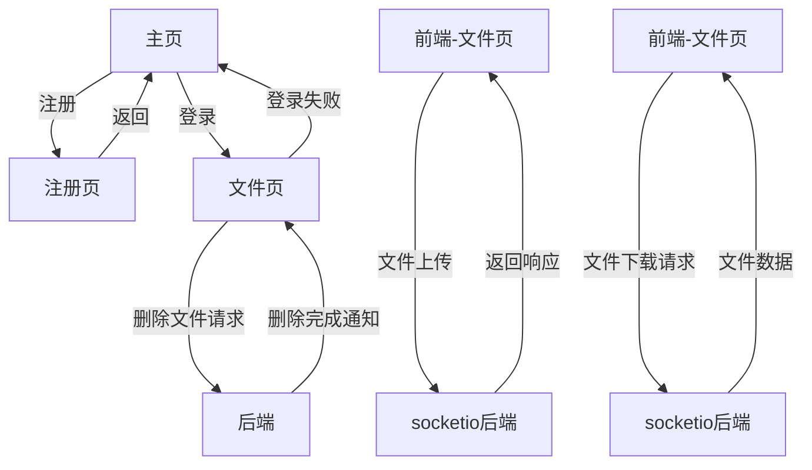
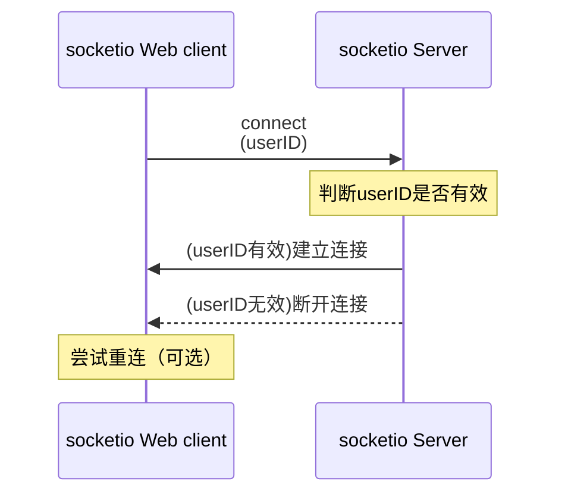
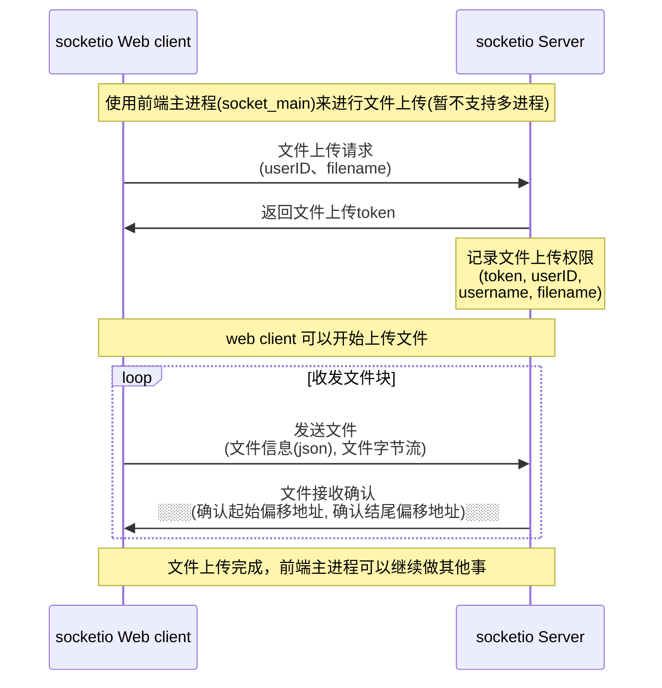
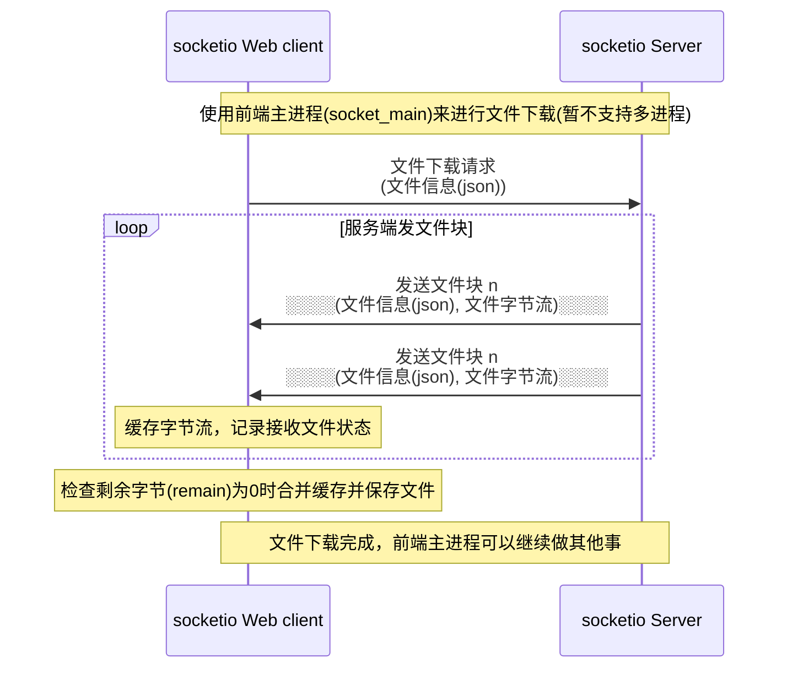
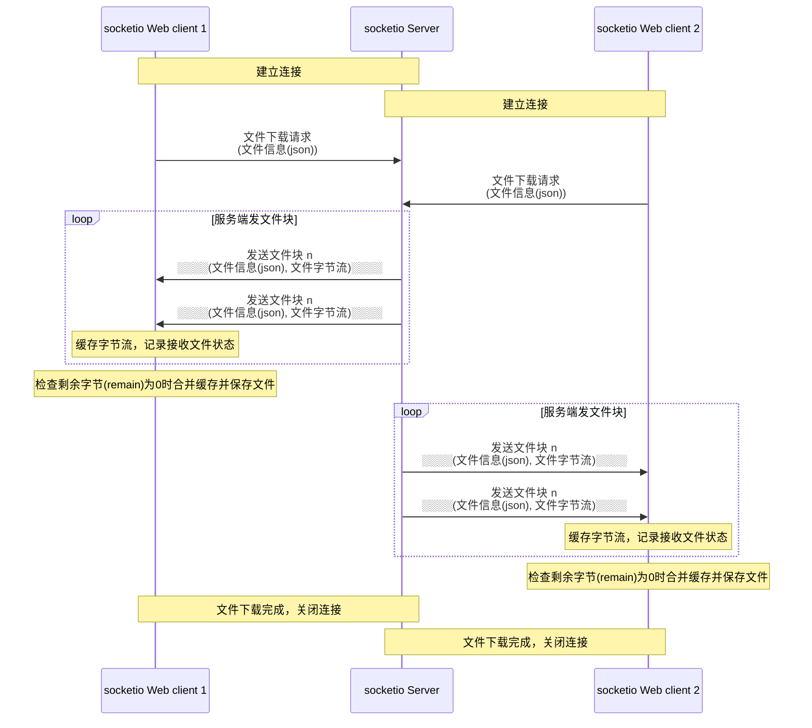

# CP_Cloud ——你的云端硬盘(伪)

Github存储库：[https://github.com/TCPsoftware/wlgfjc-1B/](https://github.com/TCPsoftware/wlgfjc-1B/)

本文档在线地址：[https://github.com/TCPsoftware/wlgfjc-1B/blob/main/The_Project_Document.md](https://github.com/TCPsoftware/wlgfjc-1B/blob/main/The_Project_Document.md)

UCAS-23秋网络攻防基础-作业1B-项目成果

## 本文目录

[toc]

## 设计

### 使用技术或框架或第三方技术

后端：python、conda、tornado、sqlite3、uuid  
前端：jQuery、Bootstrap、md5.js  
公共：letsencrypt、socket.io  
工具：VSCode、PyCharm、Chrome、mermaid  

### 流程图时序图

#### 整体流程图



#### socketio建立连接过程



#### socketio单进程文件上传



#### socketio单进程文件下载



#### socketio多进程下载（以2进程为例，更多进程同理）



### 网络包数据包结构

#### 文件删除

```json
客户端请求
POST /delete_file
{
    "filename": "aaa.txt"
}

服务端响应
成功：{"msg": "success"}
失败：{"msg": "error"}
```

#### socketio建立连接

```javascript
客户端
io.connect("wss://wlgfjc-test.tcpsoft.app", {
    transports: ["websocket"],
    pingInterval: 60000,
    pingTimeout: 25000,
    auth: {
        "userID": userID
    }
});

服务端处理
验证 auth["userID"], 验证成功则
socketio_session_map[sid] = [userID,username]

服务端响应
成功：建立socketio连接
失败：断开socketio连接
```

#### 文件上传请求

```javascript
客户端socket
emit("file_upload_request", {
    filename: file0.name,
    file_size: file0.size,
    file_type: file0.type
})

服务端socket处理
根据socketid检查用户状态，生成token，并
upload_auth_tokens[upload_token] = [userID, username, filename]

服务端socket响应
失败：未指定文件名：return {"ok":False, "msg":"error: no filename specified"}
失败：文件已存在：return {"ok":False, "msg":"error: 文件已存在"}
成功：return {"ok":True, "token":upload_token, "msg":"success, filename: " + filename}
```

#### 文件上传

```python
客户端socket
emit('file_upload', {
    "auth_token": upload_token,
    "start_offset": start_offset,
    "end_offset": end_offset,
    "remain": total_bytes - end_offset
}, binary_data_part)

服务端socket响应
检查auth_token，读取binary_data，写入缓存文件的start_offset到end_offset处
如果remain==0，则将缓存文件移动到用户文件夹，并
del upload_auth_tokens[auth_token]

服务器socket响应
成功：return {"confirm_start_offset": start_offset, "confirm_end_offset": end_offset}
失败：token无效：断开连接
```

#### 文件下载

```python
客户端socket
emit("file_download", {
    "filename": fname,
    "start_offset": start_remain,
    "end_offset": end_remain,
    "block_size": block_size
})

服务端socket处理
根据socketid获得username，获得filename，读取用户文件的start_offset到end_offset的部分
按照block_size分片，每片发送一个响应

服务端socket响应
for binary_data_slice, start_seq, end_seq in user_file.read_bytes(block_size):
    await sio.emit('file_download', ({
        "filename": filename,
        "total_start": start_offset,
        "total_end": end_offset,
        "slice_start": start_seq,
        "slice_end": end_seq,
        "slice_length": end_seq - start_seq,
        "remain_bytes": end_offset - end_seq
    }, binary_data_slice))

```

## 实现

### 0x01 网站证书

使用letsencrypt的certbot获得一个证书。

本人有一个域名，tcpsoft.app，因此可以通过修改dns的方式通过验证获得一个子域名的证书，以供本次开发的系统使用。

1. 前往certbot的github下载Windows端的certbot，安装。
2. 确定工程使用的域名：wlgfjc-test.tcpsoft.app
3. 输入命令，使用certbot获取证书：

    `certbot certonly -d wlgfjc-test.tcpsoft.app --manual --preferred-challenges dns-01`

4. 登录域名控制面板，_acme-challenge.wlgfjc-test.tcpsoft.app，添加certbot指定的txt记录
5. 等一小会等记录可以查询到后在certbot回车继续，网络通畅则稍等可以收到成功消息和证书。
6. 使用openssl工具转换pem为cer文件（可以双击cer查看证书）

    `openssl x509 -inform pem -in  cert1.pem -outform der -out cert1.cer`

    `openssl x509 -inform pem -in  chain1.pem -outform der -out chain1.cer`

    `openssl x509 -inform pem -in  fullchain1.pem -outform der -out fullchain1.cer`

7. 然后得到了 cert1.cer、chain1.cer、fullchain1.cer

此证书的一些信息：

证书颁发者【R3, Let's Encrypt, US】，证书使用者【wlgfjc-test.tcpsoft.app】

证书有效期【2023年10月17日 18:04:53】至【2024年1月15日 18:04:52】

### 0x02 搭建后端

基于`tornado`构建后端，因为`tornado`支持`socket.io`比较好，所以就考虑了这个，

实际上整个写下来服务器用得不多，感觉基本都是在`socketio`里交互

#### 数据库初始化

代码简洁干脆，一看便知。

```python
import sqlite3

def init_db():
    # 指定 SQLite 数据库文件名
    db_file = "user.db"

    # 创建或连接到数据库
    conn = sqlite3.connect(db_file)
    cursor = conn.cursor()

    # 创建用户表
    cursor.execute('''
        CREATE TABLE IF NOT EXISTS user (
            uid INTEGER PRIMARY KEY,
            username TEXT NOT NULL,
            pwd_hash TEXT NOT NULL,
            otp_seed TEXT NOT NULL
        )
    ''')

    # 提交更改并关闭数据库连接
    conn.commit()
    conn.close()
```

#### tornado主服务

简洁，实现了一个`tornado`框架，并启动。

```python
import os

import tornado.ioloop

from tcpsoft.configuration import upload_dirname
from tcpsoft.init_db import init_db
from tcpsoft.tornado_handler import create_tornado_app_sio

if __name__ == "__main__":
    # check_domain_ip()
    init_db()  # 如果没有数据库，初始化数据库
    app, sio = create_tornado_app_sio()

    # 配置 HTTPS 服务器
    http_server = tornado.httpserver.HTTPServer(app, ssl_options={
        "certfile": "./certificate/fullchain1.pem",  # SSL 证书文件
        "keyfile": "./certificate/privkey1.pem",  # SSL 私钥文件
    })

    if not os.path.exists(upload_dirname):
        os.makedirs(upload_dirname)

    # 启动 Tornado 服务器
    http_server.listen(443)  # HTTPS 服务运行在 443 端口
    print(f"为保证本服务的连接使用，请手动修改本机hosts，添加一行为：（前面ip是服务器的ip）")
    print("127.0.0.1 wlgfjc-test.tcpsoft.app")
    print("网络服务正在启动。请在浏览器打开 https://wlgfjc-test.tcpsoft.app/ 来使用服务。")

    # 启动 Tornado I/O 循环
    tornado.ioloop.IOLoop.current().start()
    # 此行后面的代码不可执行
```

#### 生成tornado对象

实现了生成`tornado`对象的函数`create_tornado_app_sio`，构建了路由绑定。

通过`socketio_handler.create_sio`函数获得了`sio`对象，然后在路由中绑定了`socketio`。

后续定义了`login_required`装饰器，也就是需要登录的接口可以用这个装饰器实现先检查登陆状态，没登陆就返回主页。

后续依次实现了`HelloHandler`、`WebRootHandler`、`RegisterHandler`、`LoginHandler`、`DiskHandler`、`DeleteFileHandler`，

用于实现常规的页面渲染、登录、文件删除的功能，此处略。

```python
import tornado.web
import socketio
import time
import uuid
import os

from tcpsoft import user_manage
from tcpsoft import file_control
from tcpsoft import socketio_handler
from tcpsoft.configuration import SESSION_UUID_EXPIRATION_TIME
import jinja2
import hashlib

# 设置模板目录
jinja_loader = jinja2.FileSystemLoader("template")
jinja_env = jinja2.Environment(loader=jinja_loader)

def create_tornado_app_sio():
    # 调用函数创建socketio实例
    sio = socketio_handler.create_sio()
    # 创建Tornado应用
    app = tornado.web.Application([
        (r"/socket.io/", socketio.get_tornado_handler(sio)),
        (r"/hello", HelloHandler),
        (r"/", WebRootHandler),
        (r"/register", RegisterHandler),
        (r"/login", LoginHandler),
        (r"/disk", DiskHandler),
        (r"/delete_file", DeleteFileHandler),
        (r"/(.*)", tornado.web.StaticFileHandler, {"path": "./static/", "default_filename": "index.html"}),
    ], cookie_secret=str(uuid.uuid4()))
    return app, sio

def login_required(handler_method):
    def check_login_wrapper(self, *args, **kwargs):
        session_uuid = self.get_cookie("u")
        state = user_manage.login_state_check(session_uuid)
        if not state:
            self.redirect("/?msg=未登录。")
        else:
            handler_method(self, *args, **kwargs)

    return check_login_wrapper

def get_session_uuid(req: tornado.web.RequestHandler):
    session_uuid = req.get_cookie("u")
    if type(session_uuid) == bytes:
        session_uuid = session_uuid.decode()
    if session_uuid and user_manage.login_state_check(session_uuid):
        return session_uuid
    else:
        return None

class HelloHandler(tornado.web.RequestHandler):
    def get(self):
        self.write("hello, world.")

class WebRootHandler(tornado.web.RequestHandler):
    def get(self):
        session_uuid = get_session_uuid(self)
        template = jinja_env.get_template("index.html")
        html = template.render()
        self.write(html)

class RegisterHandler(tornado.web.RequestHandler):
    def get(self):
        template = jinja_env.get_template("register.html")
        html = template.render()
        self.write(html)

    def post(self):
        usr = self.get_body_argument("username", "__none__")
        usr = usr.lower()  # 将用户名转换为小写
        pwd = self.get_body_argument("password", "__none__")
        if usr == "__none__" or pwd == "__none__":  # 检查是否为空
            template = jinja_env.get_template("register.html")
            html = template.render(msg="用户名或密码为空")
            self.write(html)
        elif not user_manage.is_valid_username(usr):
            template = jinja_env.get_template("register.html")
            html = template.render(msg=f"用户名只能包含字母、数字和下划线")
            self.write(html)
        elif user_manage.check_username_exist(usr):  # 如果用户名已存在
            template = jinja_env.get_template("register.html")
            html = template.render(msg=f"该用户名【{usr}】已注册！")
            self.write(html)
        else:
            pwd_hash = hashlib.md5(pwd.encode()).hexdigest()
            user_manage.user_register(usr, pwd_hash)
            # self.write(f"Hello, {usr} (POST)")
            self.redirect("/?msg=注册成功，请登录。")  # 注册成功后重定向到首页
        dbg = 1


class LoginHandler(tornado.web.RequestHandler):
    def post(self):
        usr = self.get_body_argument("username", "__tcpsoft_none__")
        usr = usr.lower()  # 将用户名转换为小写
        pwd = self.get_body_argument("password", "__tcpsoft_none__")
        if usr == "__tcpsoft_none__" or pwd == "__tcpsoft_none__":
            self.redirect("/?msg=用户名和密码不能为空")
        elif not user_manage.is_valid_username(usr):
            self.redirect("/?msg=用户名只能包含字母、数字和下划线")
        else:
            pwd_hash = hashlib.md5(pwd.encode()).hexdigest()
            login_session_uuid = user_manage.user_login(usr, pwd_hash)
            if login_session_uuid is None:
                self.redirect("/?msg=登陆失败，用户不存在或用户名与密码不匹配")
            else:
                self.set_cookie("u", login_session_uuid,
                                       expires=time.time() + SESSION_UUID_EXPIRATION_TIME)
                self.redirect("/disk")
        dbg = 1

class DiskHandler(tornado.web.RequestHandler):
    @login_required
    def get(self):
        session_uuid = get_session_uuid(self)
        username = user_manage.get_username(session_uuid)
        user_files = file_control.list_user_files(username)
        template = jinja_env.get_template("disk.html")
        html = template.render(files=user_files)
        self.write(html)

class DeleteFileHandler(tornado.web.RequestHandler):
    @login_required
    def post(self):
        session_uuid = get_session_uuid(self)
        username = user_manage.get_username(session_uuid)
        filename = self.get_body_argument("filename", "__none__")
        delete_status = file_control.delete_user_file(username, filename)
        if delete_status:
            response_data = {"msg": "success"}
        else:
            response_data = {"msg": "error"}
        self.set_header("Content-Type", "application/json")
        self.write(response_data)
```

#### 用户状态管理与数据库交互

用户状态管理。定义了：  
`cleanup_expired_session_uuids`：清除已过期的`session_uuids`，但是程序中没有调用。  
`generate_session_id`：生成会话的`userID`  
`login_state_check`：检查用户登录状态  
`login_state_add`：添加用户登录`session`  
`get_username`：通过`session`获取用户名  
`is_valid_username`：验证用户名是不是由数字字母下划线构成  
`check_username_exist`：检查用户是否存在的数据库查询操作  
`user_register`：添加用户的数据库操作  
`user_login`：用户登录的的数据库查询操作  

```python
import re
import uuid
import time
import sqlite3
import atexit
from .configuration import SESSION_UUID_EXPIRATION_TIME

# 指定 SQLite 数据库文件名
db_file = "user.db"
# 在应用初始化过程中创建数据库连接和游标
conn = sqlite3.connect(db_file)
cursor = conn.cursor()

login_user_uuid = {}

def cleanup_expired_session_uuids():
    global login_user_uuid
    current_time = time.time()
    expired_sessions = [session_uuid for session_uuid, session_info in login_user_uuid.items() if
                        current_time - session_info[1] >= SESSION_UUID_EXPIRATION_TIME]
    for expired_uuid in expired_sessions:
        del login_user_uuid[expired_uuid]

def generate_session_id():
    return str(uuid.uuid4())

def login_state_check(session_uuid):
    global login_user_uuid
    if type(session_uuid) == bytes:
        session_uuid = session_uuid.decode()
    if session_uuid in login_user_uuid.keys():
        login_user_uuid[session_uuid][1] = time.time()
        return True
    else:
        return False

def login_state_add(session_uuid, username):
    global login_user_uuid
    login_user_uuid[session_uuid] = [username, time.time()]

def get_username(session_uuid):
    if session_uuid in login_user_uuid.keys():
        return login_user_uuid[session_uuid][0]
    else:
        return None

def check_username_exist(username):
    cursor.execute("SELECT * FROM user WHERE username=?", (username,))
    result = cursor.fetchone()  # 如果结果不为空，用户名已存在
    return result is not None

def is_valid_username(username):
    # 使用正则表达式验证用户名格式
    pattern = r"^[a-zA-Z0-9_]+$"
    return re.match(pattern, username) is not None

def user_register(username, pwd_hash, otp_seed="none"):
    cursor.execute("INSERT INTO user (username, pwd_hash, otp_seed) VALUES (?, ?, ?)",
                   (username, pwd_hash, otp_seed))
    conn.commit()

def user_login(usr, pwd_hash):
    cursor.execute("SELECT * FROM user WHERE username=? AND pwd_hash=?", (usr, pwd_hash))
    result = cursor.fetchone()  # 尝试获取一行匹配的结果
    if result is not None:  # 登录成功
        session_uuid = generate_session_id()
        login_state_add(session_uuid, usr)
        return session_uuid
    else:
        return None

def close_connection():
    conn.close()

# 注册关闭数据库的操作，在应用退出时自动调用
atexit.register(close_connection)

```

最后这里还实现了关于socketio状态的管理：  
`socketio_map_add`：添加`socket`状态  
`socketio_map_remove`：删除`socket`状态  
`socketio_get_info`：通过`socketid`获得`userID`和`用户名`  

```python
socketio_session_map = {}

def socketio_map_add(sid, userID):
    global socketio_session_map, login_user_uuid
    username = get_username(userID)
    socketio_session_map[sid] = [userID,username]
    dbg=1

def socketio_map_remove(sid):
    global socketio_session_map
    if sid in socketio_session_map.keys():
        uid,uname = socketio_session_map[sid]
        del socketio_session_map[sid]
        return uid,uname
    else:
        return None

def socketio_get_info(sid):
    userID, username = socketio_session_map[sid]
    return userID, username
```

#### 文件管理函数和类

管理用户文件，提供api直接读取和写入文件，避免重复写复杂的文件读写代码。

定义了：  
`upload_file_exists`：检查文件是否存在  
`format_bytes`：格式化字节数字到可读格式  
`list_user_files`：列出用户文件夹中的文件  
`delete_user_file`：删除用户文件夹中的一个文件  
`write_cache_file`：写入缓存文件，用于文件上传的缓存  
`move_cache_to_user_dir`：将缓存文焕移动到用户文件夹，用于文件上传完成时  

```python
import os
import shutil
from datetime import datetime

from tcpsoft.configuration import upload_dirname

def upload_file_exists(username, filename):
    if filename == "__none__":
        return True
    file_path = os.path.join(upload_dirname, username, filename)
    return os.path.exists(file_path)

def format_bytes(bytes_count):
    if bytes_count < 1024:
        return f"{bytes_count} B"
    elif bytes_count < 1024 * 1024:
        return f"{bytes_count / 1024:.2f} KB"
    elif bytes_count < 1024 * 1024 * 1024:
        return f"{bytes_count / (1024 * 1024):.2f} MB"
    else:
        return f"{bytes_count / (1024 * 1024 * 1024):.2f} GB"

def list_user_files(username):
    user_root = os.path.join(upload_dirname, username)
    if not os.path.exists(user_root):
        os.makedirs(user_root)
    file_list = []
    for filename in os.listdir(user_root):
        file_path = os.path.join(user_root, filename)
        if os.path.isfile(file_path):
            file_info = {
                "name": filename,
                "size": os.path.getsize(file_path),
                "size_humanreadable": format_bytes(os.path.getsize(file_path)),
                "created_time": datetime.fromtimestamp(os.path.getctime(file_path)).strftime("%Y-%m-%d %H:%M:%S")
            }
            file_list.append(file_info)
    dbg = 1
    return file_list

def delete_user_file(username, filename):
    file_path = os.path.join(upload_dirname, username, filename)
    if filename == "__none__":
        return False
    elif os.path.exists(file_path):  # 检查文件是否存在
        try:
            os.remove(file_path)  # 删除文件
            return True
        except Exception as e:
            print(f"无法删除文件 {file_path}: {e}")
            return False
    else:
        return False

def write_cache_file(username, filename, binary_data, start_offset, end_offset):
    file_path = os.path.join(upload_dirname, username+"_"+filename)
    with open(file_path, 'a+b') as file:
        # 将二进制数据写入文件的指定位置
        file.seek(start_offset)
        file.write(binary_data)

def move_cache_to_user_dir(username, filename):
    cache_file_path = os.path.join(upload_dirname, username+"_"+filename)
    user_file_path = os.path.join(upload_dirname, username, filename)
    # 移动文件
    shutil.move(cache_file_path, user_file_path)
```

最后还实现了用户文件类，可以读取指定用户文件的一个片段，并通过迭代器多次返回数据

```python
class User_File:
    def __init__(self, username, filename, start_offset, end_offset):
        self.filepath = os.path.join(upload_dirname, username, filename)
        self.start_byte_offset = start_offset
        self.end_byte_offset = end_offset-1

    def read_bytes(self, block_size=4096):
        with open(self.filepath, 'rb') as file:  # 开启一个文件对象，使用迭代器返回多片数据，而不是多次打开和定位文件
            file.seek(self.start_byte_offset)  # 定位到start
            while file.tell() <= self.end_byte_offset:
                start_byte_seq = file.tell()
                data = file.read(min(block_size, self.end_byte_offset + 1 - file.tell()))
                end_byte_seq = file.tell()
                if not data:
                    break
                yield data, start_byte_seq, end_byte_seq
```

#### socket.io后端管理

实现`socket`通信的主要板块。主题是一个`create_sio`函数，它生成一个`sio`对象之后给他绑定了很多函数。

首先是`connect`和`disconnect`和`message`，常规的通信相关函数。

这里需要注意的是`socket`的`connect`验证`auth`里的`userID`，如果验证失败断开连接。

意思就是如果保持着的连接，就是有用户登录的在使用的`socket`。

当`disconnect`时，服务端清除断线用户的`socket`的相关的信息，避免无效信息增加。

```python
import socketio
from tcpsoft.configuration import socketio_ping_interval, socketio_ping_timeout
from tcpsoft import user_manage
from tcpsoft import file_control

upload_auth_tokens = {} # 用户上传文件时的临时授权token

def create_sio():
    # 创建Socket.IO实例
    sio = socketio.AsyncServer(async_mode='tornado',
                            cors_allowed_origins="*",
                            ping_interval=socketio_ping_interval, # 每60秒发送一次ping
                            ping_timeout=socketio_ping_timeout)  # 如果25秒内没有收到pong，则视为超时)

    @sio.on("connect")
    async def handle_connect(sid, environ, auth):
        userID = auth["userID"]
        if user_manage.login_state_check(userID):
            user_manage.socketio_map_add(sid, userID)
            print(f'Connection established for SID: {sid}')
        else:
            pass
            print(f'Connection cutdown for SID: {sid}')
            await sio.disconnect(sid)
        dbg=1

    @sio.on("disconnect")
    async def handle_disconnect(sid):
        lookup_result = user_manage.socketio_map_remove(sid)
        if lookup_result:
            userID, username = lookup_result
            for key, value in upload_auth_tokens.copy().items():
                if value[0] == userID:
                    del upload_auth_tokens[key]
        print('disconnect ', sid)

    @sio.on('message')
    async def handle_message(sid, data):
        # 处理从客户端接收的消息
        userID, username = user_manage.socketio_get_info(sid)
        print('message event get an message {} from {}'.format(data, sid))
        await sio.emit('response', f'Server received user【{username}】: 【{str(data)}】', room=sid)
```

然后是`file_download`的处理函数，首先通过`sid`获得`userID`和`username`，获得用户想下载的部分，

然后使用`user_file.read_bytes`进行读取，并把每一个分片向用户返回。

```python
    @sio.on("file_download")
    async def handle_file_download(sid, json_info):
        userID, username = user_manage.socketio_get_info(sid)
        filename = json_info['filename']
        start_offset = int(json_info['start_offset'])
        end_offset = int(json_info['end_offset'])
        block_size = int(json_info.get('block_size', 4096))
        file_size_all = end_offset - start_offset
        user_file = file_control.User_File(username, filename, start_offset, end_offset)
        # ii = []
        for binary_data_slice, start_seq, end_seq in user_file.read_bytes(block_size):
            # ii.append(i)
            await sio.emit('file_download', ({
                "filename": filename,
                "total_start": start_offset,
                "total_end": end_offset,
                "slice_start": start_seq,
                "slice_end": end_seq,
                "slice_length": end_seq - start_seq,
                "remain_bytes": end_offset - end_seq
            }, binary_data_slice), room=sid)
        # binary_data = b'\x48\x65\x6C\x6C\x6F'*8000  # 二进制数据，例如 "Hello"
        # await sio.emit('file_download', (json_info, binary_data), room=sid)
        # await sio.emit('file_download', (json_info, binary_data), room=sid)
        dbg=1
```

然后是`file_upload_request`的处理函数，通过`sid`获得`userID`和用户名，通过`file_info`获得用户希望上传的文件名，

并生成一个`文件上传token`并返回。

```python
    @sio.on("file_upload_request")
    async def handle_file_upload_request(sid, file_info):
        userID, username = user_manage.socketio_get_info(sid)
        filename = "__none__"
        if "filename" in file_info.keys():
            filename = file_info["filename"]
        else:
            # await sio.emit('file_upload_request', {"ok":False, "msg":"error: no filename specified"}, room=sid)
            return {"ok":False, "msg":"error: no filename specified"}
        if file_control.upload_file_exists(username, filename):
            # await sio.emit('file_upload_request', {"ok":False, "msg":"error: 文件已存在"}, room=sid)
            return {"ok":False, "msg":"error: 文件已存在"}
        upload_token = user_manage.generate_session_id()
        upload_auth_tokens[upload_token] = [userID, username, filename]
        # await sio.emit("file_upload_request", {"ok":True, "token":upload_token, "msg":"success"}, room=sid)
        print("发放文件上传token: ", upload_token, [userID, username, filename])
        return {"ok":True, "token":upload_token, "msg":"success, filename: " + filename}
```

然后是`file_upload`处理函数，此处根据`file_info`获得文件片段的信息，获得`文件上传token`，认证通过后，

将`binary_data`缓存到指定文件。如果`remain==0`则代表上传完成，此时将缓存文件移动到用户目录，完成上传。

每次收到文件上传包都返回一个确认消息，确认收到的`起始字节`和`结束字节`序号。

```python
    @sio.on("file_upload")
    async def handle_file_upload(sid, file_info, binary_data):
        auth_token = file_info["auth_token"]
        if auth_token in upload_auth_tokens: # 认证令牌有效
            userID, username, filename = upload_auth_tokens[auth_token]
            start_offset = file_info["start_offset"]
            end_offset = file_info["end_offset"]
            file_control.write_cache_file(username, filename, binary_data, start_offset, end_offset)
            if file_info["remain"] == 0: # 文件上传完成，保存文件并从缓存中删除
                file_control.move_cache_to_user_dir(username, filename)
                del upload_auth_tokens[auth_token]
            return {"confirm_start_offset": start_offset, "confirm_end_offset": end_offset}
        else: # 无效的认证令牌，拒绝上传，断开连接
            await sio.disconnect(sid)

    return sio
```

### 0x03 前端实现

根据相关的业务逻辑进行搭建和实现，大部分代码略。

这里主要讲多进程下载的任务分配代码、多进程下载、多进程进度条更新的代码。

#### 多进程下载任务分配

这里使用大小为`4096`长度的文件作为基本块，这样的大小对于磁盘读写有好处，同时这个大小又一般不会超过发包的`MTU(Maximum Transmission Unit, 最大传输单元)`，是比较不错的选择。（如果MTU更大的话可以考虑更大的基本块）

这里使用固定的`8`个`socket`进行多进程下载，在实际中大部分情况下一共会创建`9`个`socket`。

首先对文件大小进行计算，需要整除 `8*4096`，此时每整除一次，一个`socket`就分配`4096`的任务。根据整除结果`num_blocks_per_worker`，每个`socket`分配`num_blocks_per_worker`个基本块的任务。

对于不能整除 `8*4096` 的部分，一般是文件末尾，文件大小小于 `8*4096`，此时将其称为`remain`，然后再创建一个`socket`来单独下载这个部分。

上面的`socket`按照顺序分别各处理`num_blocks_per_worker`个基本块的数据，并加入`socket_list`中，最后一个`socket`处理剩余的字节，也加入`socket_list`中。

```javascript
const workers = 8;
const block_size = 4096;
const worker_period_block_size = workers * block_size;
const num_blocks_per_worker = Math.floor(bytes_all / worker_period_block_size);
socket_list = [];
// let socket_list = [];
let $pgbar = $('<div class="progress-stacked"></div>');

$("#messages").append($pgbar);
let $speed = $('<div></div>');
$("#messages").append($speed);

if (num_blocks_per_worker>0){ // 每个worker分到的块至少为1
    for (let w = 1; w <= workers; w++) {
        let start = (w - 1) * num_blocks_per_worker * block_size;
        let end = w * num_blocks_per_worker * block_size;
        console.log(`worker ${w}: [${(w - 1)}*${num_blocks_per_worker}*${block_size}=${start}, ${w}*${num_blocks_per_worker}*${block_size}=${end})`);
        let socket_tmp = create_socketio_thread(start_offset=start, end_offset=end, download_when_done=false, done_callback=null)
        socket_tmp.emit("file_download", { filename: fname, start_offset: start, end_offset: end, block_size: block_size });
        socket_list.push(socket_tmp);
        $pgbar.append($('\
        <div class="progress" role="progressbar" style="width: 0%">\
            <div class="progress-bar bg-primary"></div>\
        </div>\
        <div class="progress" role="progressbar" style="width: 0%">\
            <div class="progress-bar bg-tcp_gray"></div>\
        </div>'));
    }
}
const remain_size = bytes_all % worker_period_block_size;
const start_remain = workers * num_blocks_per_worker * block_size;
const end_remain = bytes_all;
console.log(`remain size: ${remain_size} bytes`);
console.log(`remain range: [${start_remain}, ${end_remain}), ${end_remain - start_remain}`);
if (remain_size > 0) {
    let socket_remain = create_socketio_thread(start_offset=start_remain, end_offset=end_remain, download_when_done = false, done_callback = null);
    socket_remain.emit("file_download", { "filename": fname, "start_offset": start_remain, "end_offset": end_remain, "block_size": block_size });
    socket_list.push(socket_remain);
    $pgbar.append($('\
    <div class="progress" role="progressbar" style="width: 0%">\
        <div class="progress-bar bg-primary"></div>\
    </div>\
    <div class="progress" role="progressbar" style="width: 0%">\
        <div class="progress-bar bg-tcp_gray"></div>\
    </div>'));
}
```

#### socketio下载事件处理

当一个`socket`对象收到`file_download`事件时，获取文件片段的信息，检查是否与上个时间的文件首尾能够相连，如果是则把二进制文件流加入到缓存数组中，并更新缓存首尾位置信息。如果`remain==0`则表示下载完毕，此时选择保存文件（单进程）或者调用回调函数（多进程），如果没有回调函数就直接结束，等其他地方的代码定时检查下载状态并保存文件。

```javascript
socket.on('file_download', function (file_info, binaryData) {
    file_info_demo_response = {
        "filename": "hello-uniapp-master.zip", "total_start": 0,"total_end": 833627,
        "slice_start": 0,"slice_end": 4096,"slice_length": 4096, "remain_bytes": 829531
    }
    if (file_info["slice_length"] > 0) { // 有数据才加入缓存
        if (file_info["slice_start"] === socket.tcpsoft_cache.byte_end) {
            socket.tcpsoft_cache.file_cache.push(binaryData);
            socket.tcpsoft_cache.byte_end = file_info["slice_end"];
        } else {
            // 如果不连续，输出提示
            console.log('sequence wrong:', socket, file_info);
            socket.disconnect();
            return false;
        }
    }
    if (file_info["remain_bytes"] === 0) {
        console.warn("File download finish. download_when_done=",socket.download_when_done);
        socket.tcpsoft_cache.finished = true;
        if(socket.download_when_done){
            // 如果下载完就保存，此处与下面的文件保存代码类似，不再赘述
        } else {
            if(typeof(done_callback) == "function"){
                done_callback();
            }
        }
    }
});
```

#### 进度条更新

首先设置全局变量，设置定时器函数（通过`promise`实现），然后使用定时器每`0.2s`执行一次检查逻辑。

从`socket_list`中依次取出`socket`，获得它们的下载状态，更新进度条宽度，

当时间为`整一秒时`或者`第一个0.2秒`时，计算下载速度，然后通过`dom元素`将下载进度和下载速度等信息更新到`dom`中。

```javascript
async function sleep(time_seconds) {
    return new Promise(resolve => setTimeout(resolve, time_seconds * 1000));
}

let downloaded_all_bytes = 0;
let count_time = 0;
let sleep_time = 0.2;
for (let socket_loop of socket_list) {
    while (!socket_loop.tcpsoft_cache.finished) {
        await sleep(sleep_time);
        count_time += 1
        //从list读取数据并更新进度条
        const total_bytes = bytes_all;
        let sub_pgbar = $pgbar.children();
        let current_downloaded_bytes = 0;
        for (let i in socket_list) {
            let sock_tmp = socket_list[i];
            let sock_start = sock_tmp.tcpsoft_cache.byte_start;
            let sock_end = sock_tmp.tcpsoft_cache.byte_end;
            let sock_finish = sock_tmp.tcpsoft_cache.byte_finish;
            current_downloaded_bytes += sock_end - sock_start; // 当前socket的已下载bytes
            sub_pgbar.eq(2*i).css("width", (sock_end - sock_start)/total_bytes * 100 + "%");
            sub_pgbar.eq(2*i+1).css("width", (sock_finish - sock_end)/total_bytes * 100 + "%");
        }
        if(count_time == 1 || count_time % 5 == 0) { // 每一秒统计一次下载速度
            let delta_downloaded_bytes = current_downloaded_bytes - downloaded_all_bytes;
            let all_size_text = human_readable_size(bytes_all);
            let cur_speed_text = human_readable_size(delta_downloaded_bytes)+"/s";
            downloaded_all_bytes += delta_downloaded_bytes;
            let avg_speed_text = human_readable_size(downloaded_all_bytes/(count_time*sleep_time))+"/s";
            let remain_time_text = Math.floor((bytes_all-downloaded_all_bytes)/(downloaded_all_bytes/(count_time*sleep_time)))+"s";
            $speed.text(`总大小：${all_size_text}, 当前下载速度：${cur_speed_text}, 平均下载速度：${avg_speed_text}, `+
            `耗时: ${count_time*sleep_time}s, 预计剩余时间：${remain_time_text}`);
        }
    }
}
$pgbar.find(".progress-bar").addClass("bg-success");
console.warn("All workers finished downloading.【"+fname+"】");
$("#messages").append("<p>所有下载进程已完成下载【"+fname+"】。</p>");
```

#### 文件保存

常规的数据保存到`blob对象`然后通过`a标签`点击触发下载。

```javascript

console.warn("Merging and downloading files...【"+fname+"】");
$("#messages").append(`<p>正在合并然后保存文件【${fname}】到本地。</p>`);

let full_file_data = [];
for (let socket_tmp of socket_list) {
    full_file_data.push(...socket_tmp.tcpsoft_cache.file_cache);
}
let blob = new Blob(full_file_data);
let url = URL.createObjectURL(blob);
let a = document.createElement('a');
a.href = url;
a.download = fname;
a.click();
URL.revokeObjectURL(url);
// 清空缓存
// debugger
socket_list.forEach((socket_tmp, loop_index) => {
    socket_tmp.tcpsoft_cache.file_cache = [];
    socket_tmp.disconnect();
    socket_list[loop_index] = null;
});
// debugger
```

## 参考资料

Github文档：创建图表 [https://docs.github.com/zh/get-started/writing-on-github/working-with-advanced-formatting/creating-diagrams](https://docs.github.com/zh/get-started/writing-on-github/working-with-advanced-formatting/creating-diagrams)

创建图表的mermaid的文档：[https://mermaid.js.org/intro/](https://mermaid.js.org/intro/)

Bootstrap文档：[https://getbootstrap.com/docs/5.3/forms/form-control/](https://getbootstrap.com/docs/5.3/forms/form-control/)

python-socketio的一个文档：[https://python-socketio.readthedocs.io/en/latest/intro.html#server-examples](https://python-socketio.readthedocs.io/en/latest/intro.html#server-examples)

python-socketio的另一个文档：[https://www.jianshu.com/p/662977c00d80](https://www.jianshu.com/p/662977c00d80)

javascript的socketio的一个文档：[https://socket.io/zh-CN/docs/v4/client-api/#socketsendargs-ack](https://socket.io/zh-CN/docs/v4/client-api/#socketsendargs-ack)

还有一些博客、日志、代码片段、搜索结果，此处不再不一一列举

项目参考了QQ邮箱平台的登录页面布局设计思路。

项目参考了 IDM(Internet Download Manager) 的多线程下载进度条视觉效果灵感。
